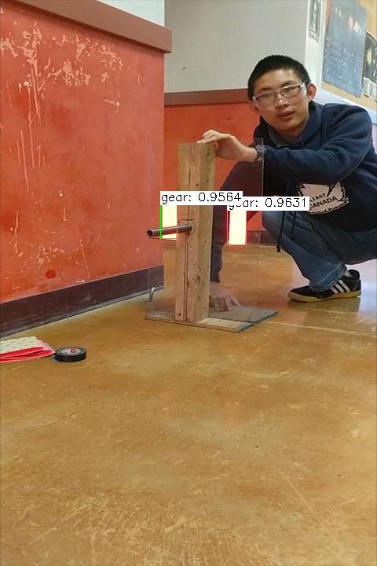
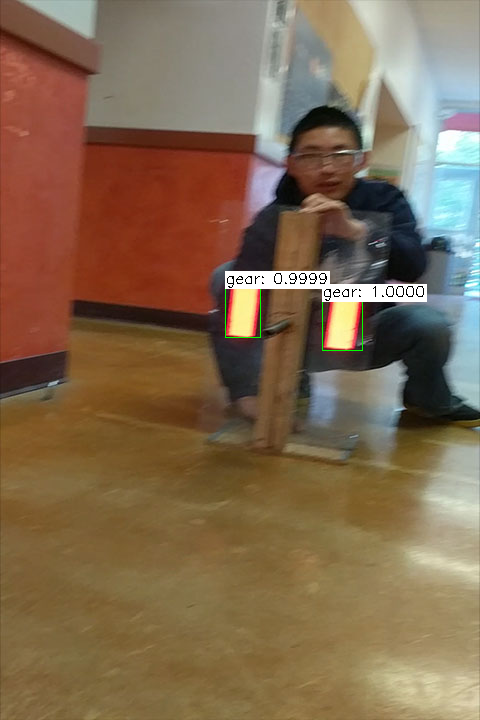

# Team 4159 Reflective Tape Detector

This is a CNN (convolutional neural network) for detecting reflective tape in FIRST Steamworks. It uses Single-Shot Detection forked from [weiliu89/caffe](https://github.com/weiliu89/caffe/tree/ssd/).

## Installation
tl;dr:
Create a fresh install of Ubuntu 17.04.
Install packages. Install GCC 6.4 instead of 7 to avoid having to build and install 6.4
Install CUDA 9.1
Config and Build SSD Caffe

Note: If building caffe on the **Jetson**, this link might help solve some errors: https://github.com/dusty-nv/jetson-inference/issues/9. Gcc versions higher than 5 are also not supported.

1. Install the following packages:
```Shell
sudo apt-get install libprotobuf-dev libleveldb-dev libsnappy-dev libopencv-dev libhdf5-serial-dev protobuf-compiler libboost-all-dev libatlas-base-dev python-dev python3-dev libgflags-dev libgoogle-glog-dev liblmdb-dev python-numpy gcc-6 g++-6 bison curl flex g++-multilib gcc-multilib git gperf lib32ncurses5-dev lib32readline-dev lib32z1-dev libesd0-dev liblz4-tool libncurses5-dev libsdl1.2-dev libssl-dev libwxgtk3.0-dev libxml2-utils lzop pngcrush schedtool xsltproc python-skimage python-pip
sudo pip install protobuf
```

2. Install CUDA 9.1 (download from nvidia, nvidia-cuda-toolkit has version 8). This requires GCC 6.x (6.4), because GCC 5.3 will NOT work on Ubuntu 17.10 (and I presume 17.04): 
https://stackoverflow.com/questions/39130040/cmath-hides-isnan-in-math-h-in-c14-c11
http://docs.nvidia.com/cuda/cuda-installation-guide-linux/index.html#ubuntu-installation

3. Add environment variables to ~/.bashrc, then run ```source ~/.bashrc``` to persist them:
```
export PATH=/usr/local/cuda/bin${PATH:+:${PATH}}
export LD_LIBRARY_PATH=/usr/local/cuda/lib64${LD_LIBRARY_PATH:+:${LD_LIBRARY_PATH}}
export CAFFE_ROOT=/home/<YOUR_USERNAME>/caffe
export PYTHONPATH=$CAFFE_ROOT/python:$PYTHONPATH
```

4. Building SSD Caffe:
* Copy the Makefile.config from setup to the root folder
* Fix error of CUDA version in boost. Copy the nvcc.hpp in setup to /usr/include/boost/config/compiler/nvcc.hpp

Now build (jN refers to build with N virtual cores, replace with the number of cores for your computer):
```Shell
make -j8
make py -j8
make test -j8
```
## Directory Structure
* data - Each dataset has a folder that contains text files and the training and test set, the labelmap, and scripts to make them.
* examples - The SSD folder contains all the scripts we will be using to train and test models as well as using models for detection.
* models - For each dataset the model file and metadata will be created in its folder. Snapshots will be here to which can be used to resume training from that point.
* ~/data - Where the dataset resides and has folders for Annotations and the images. Test results will also be in this folder.

## Preparing Data

Follow the directions in our [data repo](https://github.com/Team4159/caffe-data) to prepare our data to be trained.

## Training
Find and open examples/ssd/ssd_pascal_steamworks.py, and look for the base_lr and batch_size, and accum_batch_size variables. The learning rate determines how fast the training will advance in regards of optimizing the CNN's accuracy. The slower the learning rate, the more accurate it will be, but the faster the learning rate the more likely it can overshoot and diverge and thus making the model useless. This is indicated by a loss of NaN in the log. So how can we prevent this? By adjusting the base_lr (base learning rate). 

Also be aware of high memory usage during training. If the batch_size is too high (more than 4) then the program will crash, too low and the learning may diverge. So far 4 seems to work best for a 3GB GeForce 1060 GTX, and the accum_batch_size should be 16 to compensate for that. There also needs to be enough memory for testing while training, or it can be skipped by setting test_interval higher than max_iter.

Finally, train the model. This will take some time (4.5 hours for 10000 iterations for me):

```Shell
cd $CAFFE_ROOT
python examples/ssd/ssd_pascal_steamworks.py
```
## Verification
You can evaluate a model by editing score_ssd_pascal.py to test the newly created model again a test set, similar to training except training does not occur. Change test_batch_size if the GPU runs out of free memory. The easiest way to test the model with a given image is to use ssd_detect in the examples folder, which takes in an image and outputs any detected objects (remember to run it from the root folder). You can also install Jupyter Notebook and follow [these directions](https://github.com/weiliu89/caffe/blob/ssd/examples/ssd_detect.ipynb) in order to visualize detection.

## OpenCV Integration
Now we get to the main purpose of the project, to use the model for real time detection! 

### Compiling OpenCV on Ubuntu
First we must compile the latest version of OpenCV (3.4.0) with the right dependencies and arguments. 

Note: Due to the package installation, GCC 7 and 6 were installed. CMake will always detect GCC 7 and compiling the CUDA modules will fail, even when using update-alternatives. The simple solution is to explicitly tell CMake the compiler paths:
```
export CC=/usr/bin/gcc-6
export CXX=/usr/bin/g++-6
```

Download the source zip file, extract it, then open a terminal and execute
```
mkdir build
cd build
cmake -D CMAKE_BUILD_TYPE=RELEASE -D CMAKE_INSTALL_PREFIX=/usr/local -D FORCE_VTK=ON -D WITH_TBB=ON -D WITH_V4L=ON -D WITH_QT=ON -D WITH_OPENGL=ON -D WITH_CUBLAS=ON -D CUDA_NVCC_FLAGS="-D_FORCE_INLINES --expt-relaxed-constexpr" -D WITH_GDAL=ON -D WITH_XINE=ON -D BUILD_EXAMPLES=ON ..
make -j8
sudo make install
```

The "--expt-relaxed-constexpr" is needed to avoid compiler errors. During configuration some packages will not be found when using Ubuntu 17.10, this is not a big problem as long as the "Configuration Done" line is shown.

Compiling will take a long time, so relax in the mean time.

### OpenCV on the Robot
We must use a coprocessor (ideally a Jetson - we haven't confirmed OpenCL support)

### Using OpenCV
Use ```examples/ssd_opencv_ml.py``` to run forward propagation with the inputted image, which will show any detected objects and the time it took. Here are some results:




### TODO
* Use cuDNN and measure performance improvement
* Optimize this CNN

